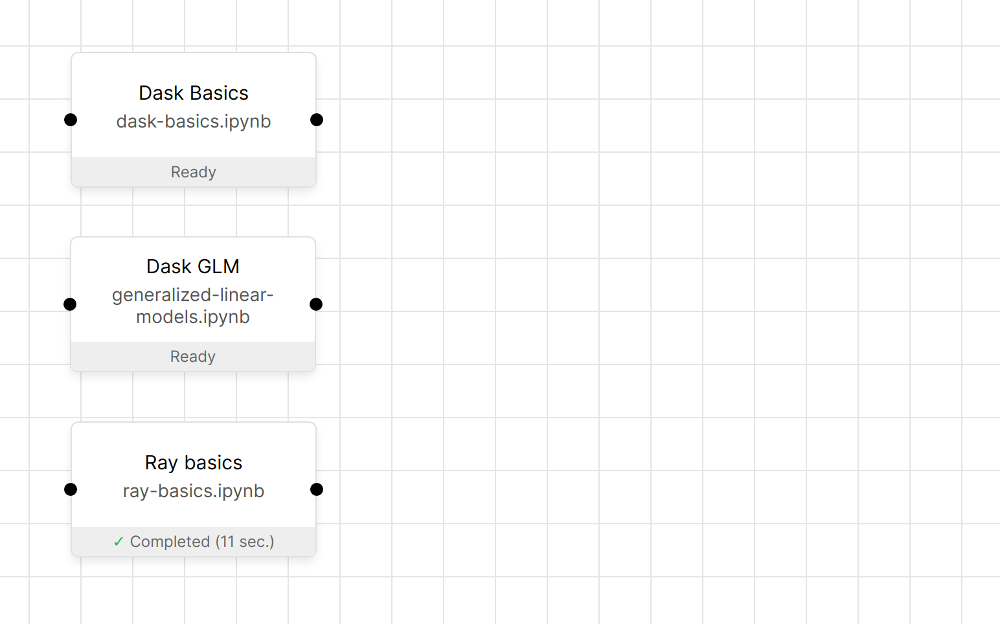

### Dask + Ray pipeline in Orchest

This repo contains a basic pipeline that runs a 'hello world' application created in Dask and Ray respectively.

For Dask we also run the Dask Generalized Linear Models example code.

